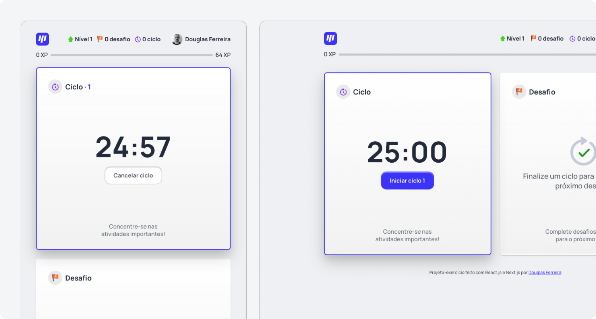
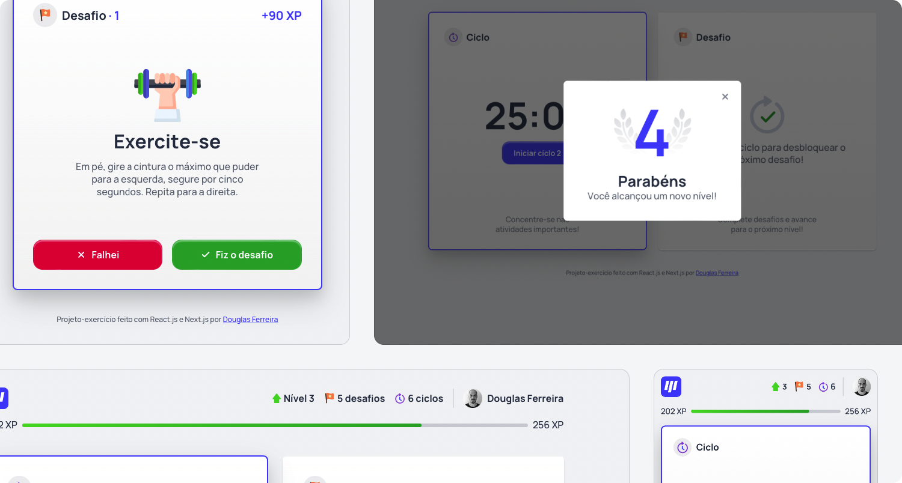
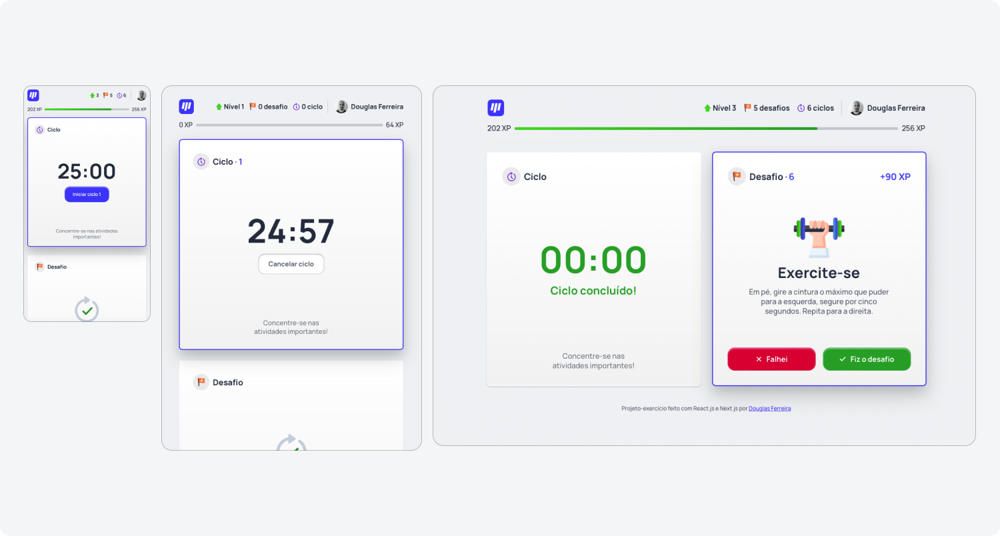

# Gamified timer

A Pomodoro timer for deep-work sessions with some gaming elements to bring more fun, motivation, and encourage you to take healthy breaks between work sessions. [Interact with the live project here](https://gamified-timer-douglasf.vercel.app) (the app was built in Brazillian Portuguese).

How it works:

- Start a 25-min timer and focus on important work
- When the time is up, you are given a challenge (like go for a 3-min walk, stretch your legs, or exercise your eyes) to be completed during your break
- If you complete the challenge, you earn experience (XP) points, and with enough of it you can advance to the next level

Implemented features:

- Countdown timer
- Stats and progress bar
- Notifications via web browser (with sound)
- Responsiveness
- Scroll-to-section on mobile

## Project screenshots

 
 
 

 

## Extra notes

- As an exercise, this project wasn’t focused on advanced optimizations regarding data storage, processing, accessibility, scalability, cross-browser compatibility, etc. There’s still a lot to be done about it.
- This project was proposed by Rocketseat.
- The UI was redesigned for this exercise.
- As most projects, this one is not bug/error-free. If you find any bug or unexpected behavior, feel free to get in touch, here is my email - dfaferreira46@gmail.com
